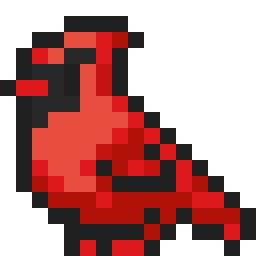
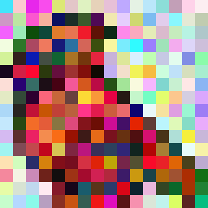
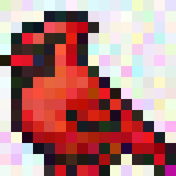
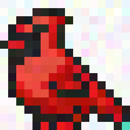
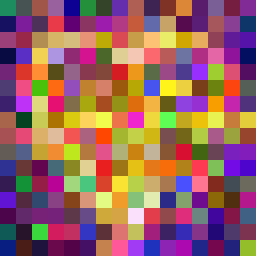
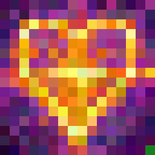
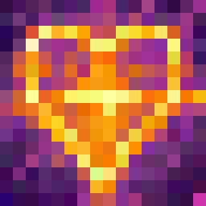

# Project Title: Genetic Algorithm for Image Evolution

## 1. Introduction

A Genetic Algorithm (GA) is a heuristic search and optimization technique inspired by the principles of natural selection and genetics. It operates by maintaining a population of candidate solutions, evaluating their quality using a fitness function, and iteratively improving the population through selection, crossover (recombination), and mutation. The goal of this project is to demonstrate a practical understanding of genetic algorithms, their core components, and the ability to implement them in Python. The specific application involves evolving a digital image to approximate a given target image.

## 2. Background & Motivation

Genetic algorithms belong to the broader field of artificial intelligence and evolutionary computation. They are particularly useful for solving complex optimization and search problems where traditional, deterministic methods may be inefficient or infeasible due to large, non-linear, or poorly understood search spaces. By simulating evolution, GAs can explore a vast number of potential solutions and converge towards high-quality answers.

This project was undertaken as part of private tutoring sessions in computer science and programming to solidify theoretical knowledge through practical application. Beyond its educational value, the chosen problem—image evolution—highlights the algorithm's potential in creative and artistic domains, where it can generate novel visual patterns and approximations.

## 3. Problem Representation

The core problem is defined as finding an image that closely matches a given 16x16 pixel reference image. In this implementation, an *individual* (a candidate image) is represented as a flat list of 256 tuples, where each tuple contains three integers representing the Red, Green, and Blue (RGB) values of a single pixel (each in the range [0, 255]). The population is a collection of such individuals.

This list-based representation was chosen over a more abstract or object-oriented structure for its simplicity and lower computational overhead, which is beneficial given the iterative nature of the algorithm and the frequent access and modification of pixel data.

## 4. Genetic Algorithm Overview

The implemented algorithm follows a standard generational GA cycle:
1.  A reference (target) image is loaded and converted into its list representation.
2.  An initial population of random images is generated.
3.  A generational loop begins, which continues until a predefined stopping criterion is met.
4.  Within each generation (epoch):
    a. The fitness of every individual in the population is evaluated against the reference.
    b. A selection mechanism removes the least fit individuals.
    c. The population is replenished to its original size by creating new individuals through crossover and mutation of the selected parents.
5.  Upon termination, the best individual found across all generations is converted back into an image and displayed.

## 5. Initial Population

The algorithm initializes the search by creating a population of `POPULATION_SIZE` (default: 10) individuals. Each individual is a list of 256 randomly generated RGB pixels. A population size of 10 represents a trade-off: it provides a sufficient level of initial genetic diversity to begin the evolutionary process while remaining computationally manageable for this educational implementation. The parameter is easily adjustable to study its effect on convergence speed and solution quality.

## 6. Fitness Function

The fitness function quantifies how closely an individual resembles the target image. For each corresponding pixel in the individual and the reference, the absolute differences in R, G, and B values are calculated. The fitness score for the entire image is the sum of these differences across all 256 pixels. Consequently, a *lower* fitness score indicates a *better* (more similar) image. A score of 0 would represent a perfect match.

The implementation required pairing each individual with its calculated fitness for sorting. This was achieved using Python's `zip` function to create a list of tuples, which was then sorted using a `lambda` function as the key to order by the fitness value.

## 7. Selection Method

The selection pressure is applied by an elitist truncation method. After evaluating the population, a fixed proportion (default: 0.5, i.e., 50%) of the worst-performing individuals is permanently removed. This ensures that only the fitter half of the population proceeds to the reproduction phase, guiding the search towards more promising regions of the solution space.

## 8. Crossover (Recombination)

The crossover operator creates a new child individual from two parent individuals selected at random from the surviving population. Two recombination strategies are implemented with equal probability:
1.  **Alternating Pixels:** The child's pixels are created by alternately taking one pixel from the first parent and the next from the second parent.
2.  **Half-and-Half Split:** The child is formed by taking the first half of its pixels from one parent and the second half from the other parent.
This introduces genetic diversity by combining traits from different parents.

## 9. Mutation

Mutation introduces random changes to maintain genetic diversity and prevent premature convergence. With a 50% probability per newly created child, a single, randomly chosen pixel in that child is replaced with a new tuple of random RGB values. This stochastic process allows the algorithm to explore new solutions that may not be reachable through crossover alone.

## 10. Stopping Criteria

The algorithm terminates under one of two conditions, whichever is met first:
1.  **Quality Threshold:** The fitness score of the best individual in the current generation falls below the predefined `DESIRED_FITNESS` constant.
2.  **Computational Limit:** The number of generations (`epochs`) processed exceeds the `MAX_EPOCHS` constant.
Upon stopping, the algorithm outputs the best-evolved image.

## 11. Results

The implemented algorithm successfully demonstrates the core concepts of a genetic algorithm: population management, fitness-based selection, and the application of genetic operators. The evolution of the image over generations visually confirms the algorithm's convergence towards the target.

Example of the original (target) 16x16 image:

Example of an evolved image with a fitness score of approximately 30,000:

Example of an evolved image with a fitness score of approximately 10,000:

Example of an evolved image with a fitness score of approximately 5,000:

Example of the original (target) 256x256 image:

Example of an evolved image with a fitness score of approximately 30,000:

Example of an evolved image with a fitness score of approximately 10,000:

Example of an evolved image with a fitness score of approximately 5,000:

## 12. Discussion

**Implementation Challenges:**
*   Designing functions like `drop_worst` and `get_best` required effectively combining the population list with its computed fitness scores. Mastering the use of `zip` and `lambda` functions for sorting was a key learning outcome.
*   Translating between the list-based internal representation and a displayable image object using PIL's `getpixel` and `putpixel` methods was initially non-trivial but provided practical insight into low-level image manipulation.

**Potential Improvements:**
*   **Performance:** The most significant improvement would involve utilizing NumPy arrays for all image data and mathematical operations. Vectorized NumPy computations would dramatically reduce the execution time of the fitness evaluation and genetic operators.
*   **Algorithmic:** Experimenting with different selection mechanisms (e.g., tournament selection), adaptive mutation rates, and more sophisticated crossover methods could improve convergence speed and final image quality.
*   **Features:** Extending the project to handle larger images, different color spaces, or using shapes (polygons, circles) as genetic material instead of raw pixels could be fascinating avenues for further exploration.

## 13. Conclusion

This project constitutes a complete and functional implementation of a genetic algorithm applied to an image approximation problem. It successfully translates the theoretical steps of a GA—initialization, fitness evaluation, selection, crossover, and mutation—into a concrete Python program. The work demonstrates not only an understanding of evolutionary algorithms but also practical software development skills, including problem decomposition, algorithm design, and the use of external libraries (PIL). The project serves as a solid foundation for understanding heuristic search methods and can be extended in numerous computationally interesting and artistically creative ways.

## 14. References 
* Painterly Spell Icons part 1 by J. W. Bjerk from [opengameart.org](https://opengameart.org/content/painterly-spell-icons-part-1)
* Winter Birds by Refuzzle from [opengameart.org](https://opengameart.org/content/winter-birds)
*   Mitchell, M. (1998). *An Introduction to Genetic Algorithms*. MIT Press.
*   Pillow (PIL Fork) Documentation: [https://pillow.readthedocs.io/](https://pillow.readthedocs.io/)